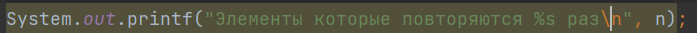
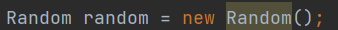

# Работа с SonarLinter в intellijIDEA

### Задача 

Нужно проверить линтером несколько своих проектов, если есть рекомендации нужно исправить.

### Решение

#### JavaImageProcessing

1. Первая рекомендация, я создал объект listFile и инициализировал его, после сразу прировнял его к списку файлов. Можно было сразу приравнять к списку файлов.

    До

    

    После

    

2. Нужно вложенные условные выражения обединить в одну.

    До

    

    После

    

#### CollectionMap

1. Нужно поменять System.out.println на logger.

    

2.  Когда необходимы и ключ, и значение, более эффективно выполнить итерацию entrySet(), которая предоставит доступ к обоим, вместо итерации по keySet() и последующего получения значения.

    До

    

    После

    

3. %n следует использовать вместо \n для создания разделителя строк, зависящего от платформы.

    До

    

    После

    

#### FileAndDirectoryJava

1. Переименуйте пакеты в соответствии с соглашением об именовании

    До

    

    После

    

#### FileJava

1. Создание нового случайного объекта каждый раз, когда требуется случайное значение, неэффективно и может привести к получению чисел, которые не являются случайными, в зависимости от JDK. Для повышения эффективности и случайности создайте один случайный объект, сохраните его и повторно используйте.

    До

    

    После

    